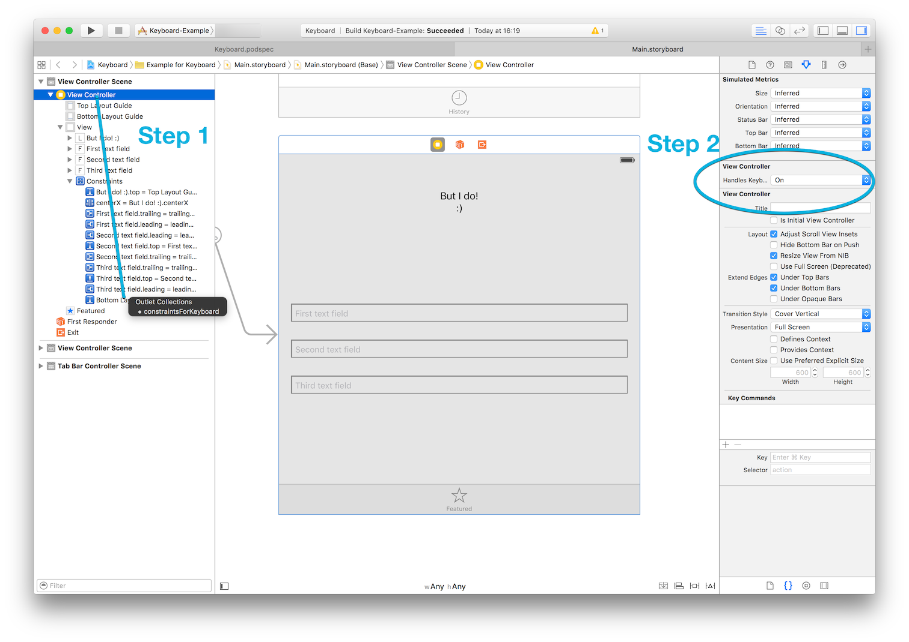

# Keyboard

Never implement UIKeyboardDidShowNotification ever again. Ever.

_v0.6.0_

## Usage



### Step 1:

ctrl + drag to your favorite layout constraint

### Step 2: 

Set your view controller's `handlesKeyboard` option to 'on'

### Step 3:

**Get on with your life**

======

**Please note** that the Simulator (iPhone 6s Plus / iOS 9.1 / 13B137) may not send the appropriate `UIKeyboardWillShowNotification`s. Pressing `cmd+K` while running on the Simulator may help. Nonetheless the Example app has been tested on a device running iOS 9.1 (13B143) and works. 

**Also please note** that you may get the following messages on the console (which don't affect the library in any way):

    _BSMachError: (os/kern) invalid capability (20)
    _BSMachError: (os/kern) invalid name (15)

## Requirements

* iOS 8+
* Swift 3.0

## Installation

### Cocoapods

Because of [this](http://stackoverflow.com/questions/39637123/cocoapods-app-xcworkspace-does-not-exists), I've dropped support for Cocoapods on this repo. I cannot have production code rely on a dependency manager that breaks this badly. 

### Git Submodules

**Why submodules, you ask?**

Following [this thread](http://stackoverflow.com/questions/31080284/adding-several-pods-increases-ios-app-launch-time-by-10-seconds#31573908) and other similar to it, and given that Cocoapods only works with Swift by adding the use_frameworks! directive, there's a strong case for not bloating the app up with too many frameworks. Although git submodules are a bit trickier to work with, the burden of adding dependencies should weigh on the developer, not on the user. :wink:

To install Keyboard using git submodules:

```
cd toYourProjectsFolder
git submodule add -b submodule --name Keyboard https://github.com/BellAppLab/Keyboard.git
```

**Swift 2 support**

```
git submodule add -b swift2 --name Keyboard.git https://github.com/BellAppLab/Keyboard.git
```

Then, navigate to the new Keyboard folder and drag the `Source` folder into your Xcode project.

## Author

Bell App Lab, apps@bellapplab.com

## License

Keyboard is available under the MIT license. See the LICENSE file for more info.
