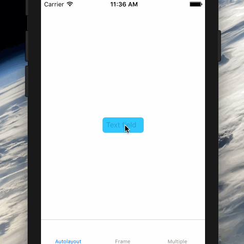
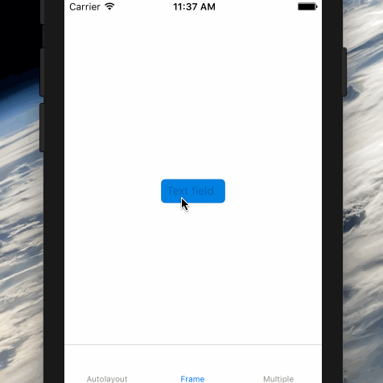
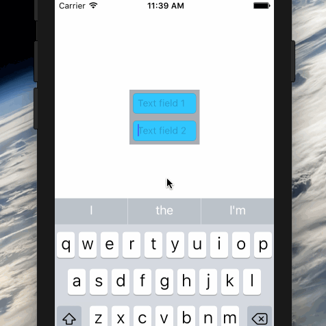
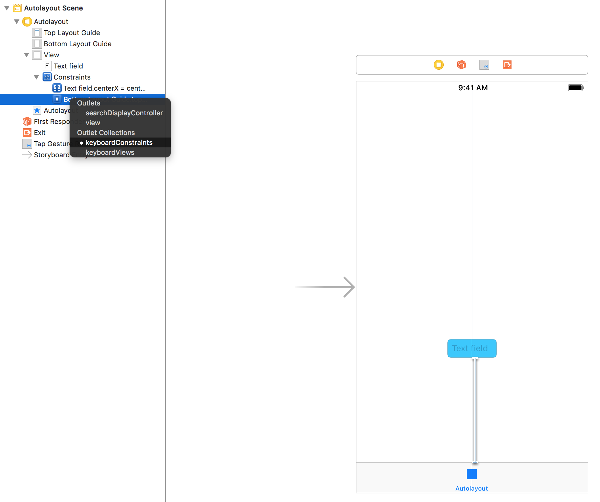

# Keyboard [](#installation) [](#license)

[](#installation)
[](#swift-versions-support)
[](https://cocoapods.org/pods/Keyboard)
[](https://github.com/Carthage/Carthage)
[](https://github.com/apple/swift-package-manager)
[](http://twitter.com/BellAppLab)






Never implement `NSNotification.Name.UIKeyboardDidShow` ever again. Ever.

Yeah, seriously. Handling the keyboard on iOS shouldn't be painful. But it is. 

So instead of doing a whole lot of calculations, or embedding everything in `UIScrollView`s, `import Keyboard` and **get on with your life**.

## Specs

* iOS 9+
* Swift 3.3+

## Usage

### Step 1:

Make your view controller conform to the `KeyboardChangeHandler` protocol: 

```swift
import Keyboard


class ViewController: UIViewController, KeyboardChangeHandler {
```

### Step 2:

Start handling keyboard notifications:

```swift
override func viewWillAppear(_ animated: Bool) {
    super.viewWillAppear(animated)

    becomeKeyboardChangeHandler()
}

override func viewWillDisappear(_ animated: Bool) {
    resignKeyboardChangeHandler()

    super.viewWillDisappear(animated)
}
```

### Step 3: 

ctrl + drag to your favorite `NSLayoutConstraint`:



### Step 4:

**Get on with your life**

## Goodies

`Keyboard` comes with a couple of niceties you might enjoy:

- The `Keyboard` singleton:

```swift
Keyboard.default.isVisible //tells you if the keyboard is currently visible
Keyboard.default.currentFrame //tells you the keyboard's frame
```

- Turning keyboard handling off:

```swift
class ViewController: UIViewController {
    override func awakeFromNib() {
        super.awakeFromNib()

        //do this if you have set up a bunch of outlets on Interface Builder
        //but don't want Keyboard to work on this view controller for now
        handlesKeyboard = false
    }
}
```

- Keyboard margin:

```swift
override func viewDidLoad() {
    super.viewDidLoad()

    [...]

    //adds a margin between the keyboard and the currently active text input
    //defaults to 40.0
    keyboardMargin = 60.0
}
```

- Finding the currently active text input:

```swift
self.view.currentFirstResponder
UIResponder.currentFirstResponder
```

## Notes

- If the Simulator doesn't show the keyboard straight away, press `cmd+K`.

- You may get the following messages on the console (which don't affect the library in any way):

```
    _BSMachError: (os/kern) invalid capability (20)
    _BSMachError: (os/kern) invalid name (15)
```

## Migrating

- **From v0.6.0**: [Check this out](./MIGRATION.md) if you're migrating from version 0.6.0.

## Installation

### Cocoapods

```ruby
pod 'Keyboard', '~> 1.0'
```

Then `import Keyboard` where needed.

### Carthage

```swift
github "BellAppLab/Keyboard" ~> 1.0
```

Then `import Keyboard` where needed.

### Swift Package Manager

```swift
dependencies: [
    .package(url: "https://github.com/BellAppLab/Keyboard", from: "1.0")
]
```

Then `import Keyboard` where needed.

### Git Submodules

```shell
cd toYourProjectsFolder
git submodule add -b submodule --name Keyboard https://github.com/BellAppLab/Keyboard.git
```

Then drag the `Keyboard` folder into your Xcode project.

## Author

Bell App Lab, apps@bellapplab.com

### Credits

[Logo image](https://thenounproject.com/search/?q=keyboard&i=159048#) by [Gregor Cresnar ](https://thenounproject.com/grega.cresnar) from [The Noun Project](https://thenounproject.com/)

## License

Keyboard is available under the MIT license. See the LICENSE file for more info.
